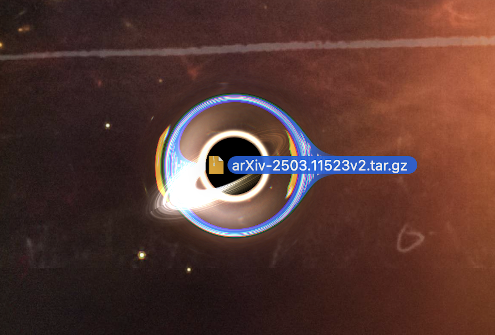

# BlackHolePlayground

Black holes that float over your real macOS desktop — lensing your windows, Dock, and
wallpaper, and lensing each other. Plus a draggable **pet** black hole you drop files
onto to send them to the Trash.

<table>
  <tr>
    <td width="50%"></td>
    <td width="50%"></td>
  </tr>
  <tr>
    <td align="center"><em>Two holes drift over the desktop — each warps the windows behind it and bends the other, with accretion-disk glow and a photon ring.</em></td>
    <td align="center"><em>The file-eating pet: drag any file onto the little hole to send it to the Trash. It lenses the desktop right behind it, too.</em></td>
  </tr>
</table>

## Quick start

```sh
bash build.sh && open "build/BlackHolePlayground.app"
```

On first launch, grant **Screen Recording** (it lenses your live screen) and open it
again. If macOS blocks it the first time, right‑click the app in Finder → **Open** → **Open**.

> Needs the Xcode Command Line Tools (`xcode-select --install`). Prefer one step?
> `bash build.sh install` builds into **/Applications** and launches it.

## Using it

- A **control panel** opens on launch — set the number of holes, size, lensing, motion,
  and more. Bring it back anytime with **⌥⌘B** or the **◍** menu‑bar icon.
- Turn on **Show file‑eating pet** for a small black hole you can drag anywhere; drop
  files on it to move them to the **Trash** (recoverable).
- **Double‑tap Esc**, or the ◍ menu, to quit.

## Docs & license

- **[MANUAL.md](MANUAL.md)** — how it works, every control, the pet, build options,
  caveats, and project layout.
- **MIT** — see [LICENSE](LICENSE). Ported from
  [s0xDk/ghostty-blackhole](https://github.com/s0xDk/ghostty-blackhole) (MIT).
